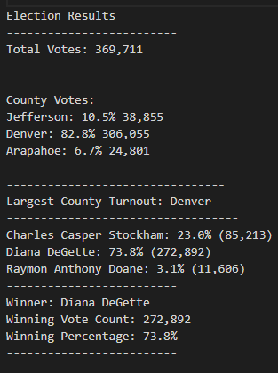

# Election Analysis

## Overview of Election Audit

The purpose of this project is to perform an audit analysis on an election held in Colorodo. The Colorodo election board 
has asked us to perform this analysis for a recent election. There are several key metrics they want to see in the analysis.

  1. Votes cast in this congressional election
  2. The number of votes and the percentage of total votes for each county in the precinct.
  3. County with the largest number of votes
  4. The number of votes and the percentage of the total votes each candidate received.
  5. Which candidate won the election, what was their vote count, and what was their percentage of the total votes.

## Summary of Election

A breakdown of the election shows the following:

  * There were 369,711 votes cast in the election
  
  * The candidates were:
    * Charles Casper Stockham
    * Diana Degette
    * Raymon Anthony Doane

  * The candidate results:
    * Charles Casper Stockham received 85,213 votes which is 23% of the vote.
    * Diana Degette received 272,892 votes which is 73.8% of the vote.
    * Raymon Anthony Doane received 11,606 votes which is 3.1% of the vote.
    
  * The winner:
      * Diana Degette who received 272,892 votes and 73.8% of the vote.

## Election Audit Summary

The winner of the election is Diana Degette with 73.8% of the vote. Denver had the highest turnout amongst the three counties.
The candidates can use this information to alter their campaigns in the future by possibly adding more television commercials,
Social media commercials, or mailing out more advertisments. Using Python allows the data to be analyzed in a manner than can 
return differnt data outcomes based on the customers needs. For election candidates, the data can be used to find demographics
of the counties and voters, plus past voting trends.
